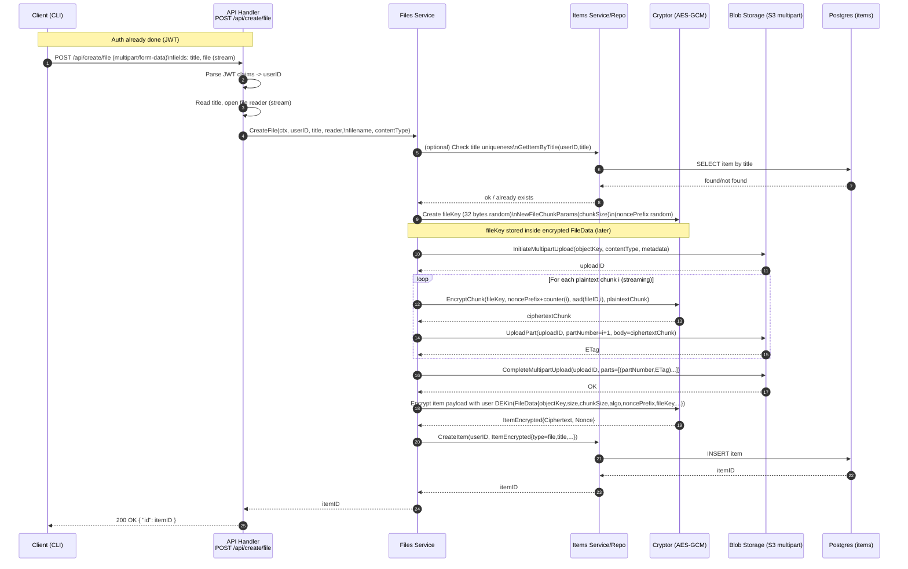

## последовательность загрузки item типа file

```mermaid
sequenceDiagram
    autonumber
    participant C as Client (CLI)
    participant H as API Handler<br/>POST /api/create/file
    participant S as Files Service
    participant I as Items Service/Repo
    participant Cr as Cryptor (AES-GCM)
    participant B as Blob Storage (S3 multipart)
    participant DB as Postgres (items)

    Note over C,H: Auth already done (JWT)

    C->>H: POST /api/create/file (multipart/form-data)\nfields: title, file (stream)
    H->>H: Parse JWT claims -> userID
    H->>H: Read title, open file reader (stream)

    H->>S: CreateFile(ctx, userID, title, reader,\nfilename, contentType)

    S->>I: (optional) Check title uniqueness\nGetItemByTitle(userID,title)
    I->>DB: SELECT item by title
    DB-->>I: found/not found
    I-->>S: ok / already exists

    S->>Cr: Create fileKey (32 bytes random)\nNewFileChunkParams(chunkSize)\n(noncePrefix random)
    Note over S,Cr: fileKey stored inside encrypted FileData (later)

    S->>B: InitiateMultipartUpload(objectKey, contentType, metadata)
    B-->>S: uploadID

    loop For each plaintext chunk i (streaming)
        S->>Cr: EncryptChunk(fileKey, noncePrefix+counter(i), aad(fileID,i), plaintextChunk)
        Cr-->>S: ciphertextChunk
        S->>B: UploadPart(uploadID, partNumber=i+1, body=ciphertextChunk)
        B-->>S: ETag
    end

    S->>B: CompleteMultipartUpload(uploadID, parts=[(partNumber,ETag)...])
    B-->>S: OK

    S->>Cr: Encrypt item payload with user DEK\n(FileData{objectKey,size,chunkSize,algo,noncePrefix,fileKey,...})
    Cr-->>S: ItemEncrypted{Ciphertext, Nonce}

    S->>I: CreateItem(userID, ItemEncrypted{type=file,title,...})
    I->>DB: INSERT item
    DB-->>I: itemID
    I-->>S: itemID

    S-->>H: itemID
    H-->>C: 200 OK { "id": itemID }
```
